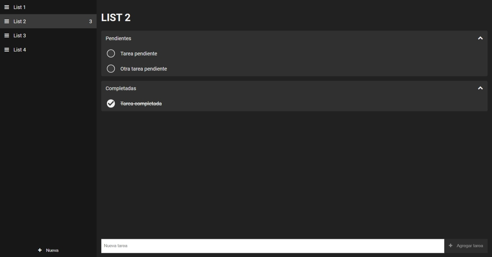

# TodoApp

Este proyecto se utiliza como base para las prácticas de la formación de "los viernes al front" para mostrar el uso de Angular en la creación de aplicaciones web, así como de sus principales características y funcionalidades.

Se trata de una aplicación de gestión de tareas. La aplicación permite al usuario crear, editar y eliminar listas de tareas, así como añasir, editar y eliminar tareas dentro de cada lista, así como marcarlas como completadas.



## Instalación

Para instalar la aplicación, es necesario tener instalado Node.js y npm. Una vez instalados, se puede instalar la aplicación ejecutando el siguiente comando en la raíz del proyecto:

```bash
npm install
```

## Ejecución

Para ejecutar la aplicación, se puede utilizar el siguiente comando:

```bash
ng serve
```

Una vez ejecutado, la aplicación estará disponible en la dirección `http://localhost:4200/`.

## Prácticas

La aplicación se utiliza como base para las prácticas de la formación de "los viernes al front". Cada práctica se encuentra en una rama diferente. Para ver el listado de prácticas, se puede ejecutar el siguiente comando:

```bash
git branch -a
```

Para cambiar a una rama concreta, se puede ejecutar el siguiente comando:

```bash
git checkout <nombre-de-la-rama>
```
